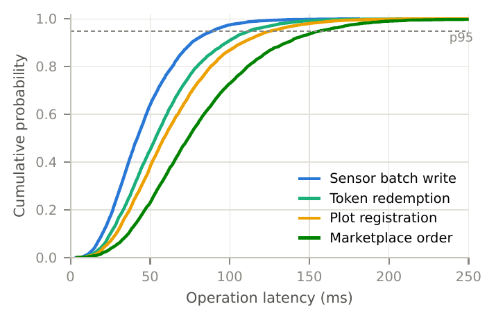
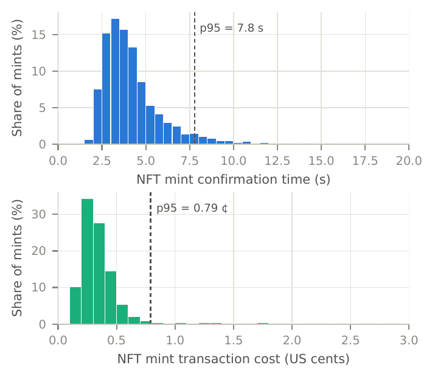
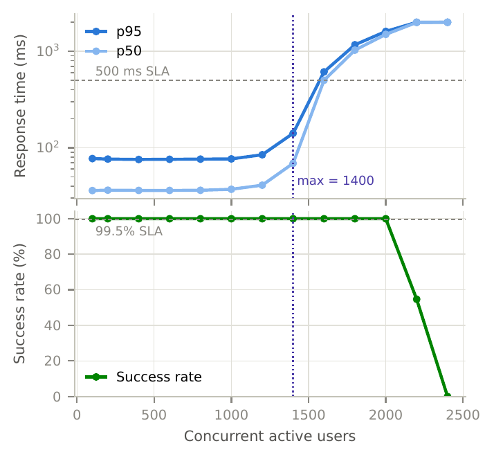
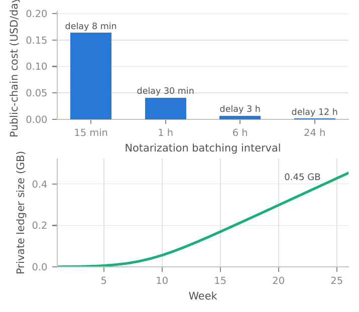
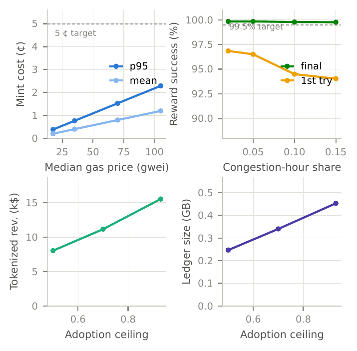

# URG Web3 VEDM — Simulation Study

Simulation pipeline behind the "Simulation-Based Evaluation" section of the
manuscript *A Performance-Aware Web3 VEDM for Decentralized Urban Rooftop
Gardening Ecosystems*. It generates a synthetic urban rooftop gardening
(URG) ecosystem, runs five experiments covering the technical KPI layer of
the performance-aware Web3 VEDM, computes the business KPIs from the same
synthetic dataset, sweeps the assumed parameters in a sensitivity analysis,
and renders every figure used in the paper.

## Requirements

Python 3 with `numpy` and `matplotlib` (no other dependencies).

## Reproduce everything

```bash
./run_all.sh
```

which runs, in order:

| Script | Role | Output |
|---|---|---|
| `generate_data.py` | Synthetic URG ecosystem: 26-week logistic household adoption, plots, sensor volume, harvest batches → NFTs, sales, token issuance/redemption, workshop attendance | `data/*.csv` |
| `run_sensitivity.py` | One-at-a-time sweeps of the assumed parameters (gas price 0.5–3×, congestion frequency, redemption rate, adoption ceiling); records the KPIs each parameter drives | `results/sensitivity.csv` |
| `run_experiments.py` | E1 platform operation latency; E2 on-chain confirmation time & cost (Layer-2 gas model); E3 closed-loop load test (discrete-event, c-server); E4 batched reward-distribution reliability with retries, averaged over 20 replicate seasons; E5 notarization batching trade-off & private-ledger storage growth; business KPIs | `results/*.csv`, `results/kpi_summary.json` |
| `make_figures.py` | Vector-PDF figures at IEEE column width (plus a PNG preview of each, for GitHub rendering), written to `figures/` **and** `../manuscript/pdf/` | `fig3`–`fig7` |

`run_sensitivity.py` runs before `run_experiments.py` because its sweeps
reuse the same experiment functions and would otherwise overwrite the
baseline result CSVs.

All parameters (ecosystem size, chain model, load-test knobs, KPI targets)
live in `config.py`; the random seed there makes runs fully reproducible.

## Model summary

- **Chain**: Polygon-PoS-like Layer 2 — 2.1 s blocks, lognormal gas price
  (median 35 gwei) with a 5% congestion-spike regime, fixed per-call gas
  budgets, USD conversion at a fixed native-token price.
- **Platform**: off-chain API + private-ledger (immudb-style) operations with
  gamma service demands; scalability via a closed-loop discrete-event
  simulation (16 workers, exponential think time, 2 s client timeout).
- **Reliability**: weekly token rewards sent as 100-transfer multisend
  chunks; chunk failures (gas underpricing/nonce races, worse during spikes)
  retried with bumped gas; residual per-transfer reverts retried manually.
- **Notarization**: Merkle-root anchoring at 15 min / 1 h / 6 h / 24 h
  intervals, trading public-chain cost against anchoring delay.

## Parameter grounding

No public dataset of a deployed Web3 URG platform exists; synthetic workloads
are the standard methodology in blockchain benchmarking (Blockbench,
Hyperledger Caliper). Infrastructure parameters are anchored to observable
reality: 2.1 s block interval and ~35 gwei median gas match public Polygon
PoS telemetry, 212k gas is a typical ERC-721 mint, and the 500-household
scale matches the order of magnitude of the FAO urban horticulture program
in Dhaka (TCP/BGD/3503). Behavioral parameters without a domain anchor
(e.g., the 55% token redemption rate, set from retail loyalty-program
benchmarks) are scenario assumptions and are swept in `run_sensitivity.py`.

These are synthetic-workload simulations, not measurements of a deployed
system — see the Limitations section of the manuscript.

## Results

### Smart contract execution latency (E1)



Empirical CDF of platform operation latency on the private ledger for the
four most frequent contract-triggering operations. p95 stays below 157 ms
for all operation types, well within the 250 ms design target.

### NFT minting time and cost (E2)



Distribution of NFT mint confirmation time (top) and transaction cost
(bottom) on the Layer-2 public chain, across 3,416 simulated harvest-batch
mints. Mean confirmation time 4.3 s (p95 7.8 s); mean cost 0.40 US cents
(p95 0.79 cents).

### Scalability under peak load (E3)



Closed-loop load test: response time (top) and request success rate
(bottom) versus concurrent active users. Both service-level objectives
(p95 ≤ 500 ms, success ≥ 99.5%) hold up to 1,400 concurrent users, three
times the simulated active household base, before a sharp collapse past
saturation.

### Notarization cost and storage growth (E5)



Public-chain notarization cost versus batching interval, annotated with
the resulting mean anchoring delay (top), and cumulative private-ledger
storage growth over the season (bottom). Hourly anchoring costs $0.04/day;
the ledger reaches 0.45 GB by week 26.

### Sensitivity analysis



One-at-a-time sweeps around the baseline: NFT minting cost versus median
gas price (top left), reward delivery success versus congestion-hour share
(top right), and tokenized revenue and private-ledger size versus adoption
ceiling (bottom). Every technical KPI stays within its target across the
full swept range, indicating the feasibility conclusions are robust to the
underlying parameter uncertainty.
